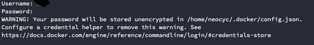

加密docker login 密碼on ubuntu 18.04
--
Docker Engine 18.09版本以後
當我們進行docker login時都會看到下面的畫面



用來提醒你你的密碼沒有加密
官方也很提供了網址，讓你可以自行安裝[Credentials store](https://docs.docker.com/engine/reference/commandline/login/#credentials-store) 

這邊介紹一下在ubuntu 18.04上，使用pass來設定docker Credntail Store

1. 下載docker-credential-pass  
請至官網上下載最新版本[docker-credential-helpers](https://github.com/docker/docker-credential-helpers/releases)    
以0.6.3為例
    ```bash
    wget https://github.com/docker/docker-credential-helpers/releases/download/v0.6.3/docker-credential-pass-v0.6.3-amd64.tar.gz
    ```
2. 解壓縮檔案，並且將其複製到$PATH的其中一個目錄，   
我這邊以/usr/local/bin為範例
    ```bash
    tar -xf docker-credential-pass-v0.6.3-amd64.tar.gz
    chmod +x docker-credential-pass
    sudo mv docker-credential-pass /usr/local/bin
    ```
3. 確認docker-credential-pass可以正常運行
    ```bash
    docker-credential-pass
    # 輸出:
    Usage: docker-credential-pass <store|get|erase|list|version>
    ```
4. 安裝gpg, pass
    ```bash
    sudo apt install -y pass gpg
    ```
5. 產生gpg key
    ```bash
    gpg --full-generate-key
    gpg (GnuPG) 2.2.4; Copyright (C) 2017 Free Software Foundation, Inc.
    This is free software: you are free to change and redistribute it.
    There is NO WARRANTY, to the extent permitted by law.
    
    Please select what kind of key you want:
       (1) RSA and RSA (default)
       (2) DSA and Elgamal
       (3) DSA (sign only)
       (4) RSA (sign only)
    Your selection? 1
    RSA keys may be between 1024 and 4096 bits long.
    What keysize do you want? (3072) 4096
    Requested keysize is 4096 bits
    Please specify how long the key should be valid.
             0 = key does not expire
          <n>  = key expires in n days
          <n>w = key expires in n weeks
          <n>m = key expires in n months
          <n>y = key expires in n years
    Key is valid for? (0) 0
    Key does not expire at all
    Is this correct? (y/N)
    # 輸出:
    ....
    public and secret key created and signed.
    
    pub   rsa4096 2019-12-23 [SC]
          BD3XXXXXXX000XX00000XXX000XXX000XXX000XX
    uid                      username <useremail@gmail.com>
    sub   rsa4096 2019-12-23 [E]
    ```
6. 用剛剛的gpg-id來進行pass init
    ```bash
    pass init BD3XXXXXXX000XX00000XXX000XXX000XXX000XX
    # output:
    Password store initialized for BD3XXXXXXX000XX00000XXX000XXX000XXX000XX
    ```
7. 執行pass insert讓pass與docker-credential-helpers關聯起來
    ```bash
    pass insert docker-credential-helpers/docker-pass-initialized-check
    # 這邊會要求你輸入兩次密碼
    ```
8. 列出docker-credential-pass的清單
    ```bash
    docker-credential-pass list
    # output:
    {}
    ```
10. 如果你已經登入了，哪請先進行登出，然後編輯$HOME/.docker/config.json這個檔案
    ```bash
    vi .docker/config.json
    # 將以下資訊寫入檔案
    {
        "credsStore": "pass"
    }
    ```
9. 如果你沒有執行過docker login哪麼現在就可以進行docker login，登入成功後你會看到~/
.docker/config.json這個檔案已經自動產生了，而且看起來會像這樣
    ```bash
    {
    	"auths": {
    		"registry.example.com": {}
    	},
    	"HttpHeaders": {
    		"User-Agent": "Docker-Client/19.03.5 (linux)"
    	},
    	"credsStore": "pass"
    }
    ```
10. 進行docker push時可能會出現denied: access forbidden這個錯誤，發生的原因是因為在產生gpg時passphrase不為空，而docker-credential-helpers並不會出現讓你輸入的畫面．有以下幾個解決方法:
    1. 登入及執行docker push前先執行以下指令，並輸入你產生gpg key時在passphrase輸入的密碼，然後就可以正常運行了
    ```bash
    pass show docker-credential-helpers/docker-pass-initialized-check
    ```
    2. 設定空的passphrase，執行後先輸入原本的passphrase然後在輸入空的passphrase
    ```bash
    # 忘記id可以使用以下指令列出gpg key
    gpg -k
    gpg --edit-key "gpg-id"
    gpg> passwd
    ```
